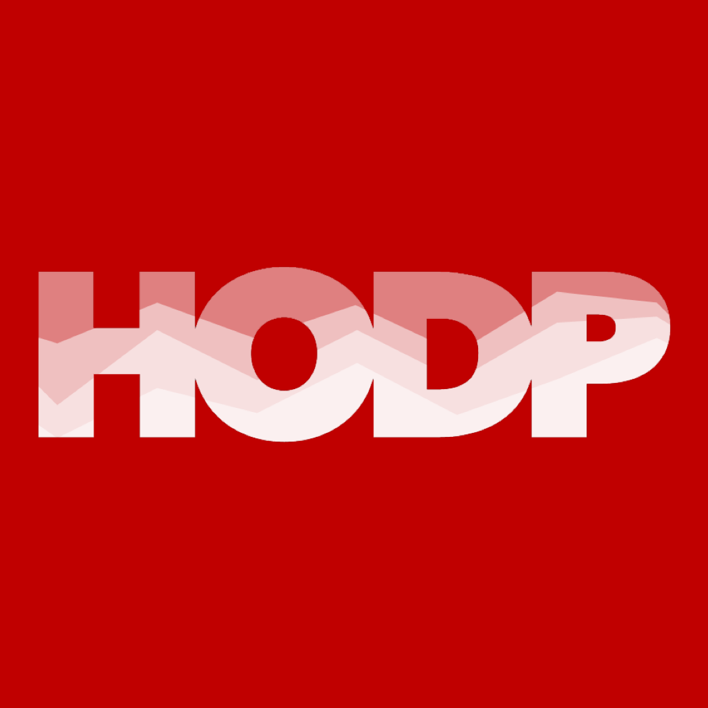

## Who we are

> We're a rebel alliance of young people using technology for social good. We're not coding to make the next food delivery app. We're coding to battle the tough problems in government, education, public health, and the like. We're coding to make the world a little bit better. **We're Coding it Forward.**

[Read our intro post to learn why we're Coding it Forward.](https://blog.codingitforward.com/a-rebel-alliance-of-young-people-using-technology-for-social-good-846eeafa9653#.40033t8rf)

## Join the alliance

We're a community of college students and young people who are excited about things like educational technology, public sector technology, international development, and spaces like that. If you're passionate about using technology for the greater good, you've just found a like-minded community that'll offer you:

- **Job and internship opportunities** from the nation's top schools.
- Connections with our **mentors**, including the former deputy CTO of the US and the founder of the [United States Digital Service](https://www.usds.gov/).
- Opportunities to work on technology and social impact **projects** with students at top schools.
- A forum to learn from other top students in the field.

And much more!

Sound exciting? Read and follow [our blog]({{ site.external.medium }}), and join our [mailing list]({{ site.external.mailing_list }}) to get special access to all our resources!

If you'd like to take a bigger role in Coding it Forward by working on projects, writing for our blog, or serving as a Coding it Forward Campus Ambassador, [fill out this application](https://goo.gl/forms/dzP68BoWeT22iKMf1).

## A bit of background

Our cofounders are a team of Harvard computer scientists passionate about using technology for social good.

- [Neel Mehta](http://hathix.com), neelmehta [at] college [dot] harvard [dot] edu
- [Athena Kan](http://athenakan.com), athenakan [at] college [dot] harvard [dot] edu
- [Chris Kuang](https://medium.com/@chriskuang), ckuang [at] college [dot] harvard [dot] edu

Want to know more? Feel free to email any or all of us!

## Coding it Forward Partners

We proudly partner with these student organizations that use technology for social good. We work with them on projects, publicity, blog posts, and more.


- [{{ partner.name }}]({{ partner.url }}), {{ partner.college }}


If your student group is interested in becoming a Coding it Forward Partner, [fill out this quick form](https://goo.gl/forms/6REK9bPwf85dRUMD3) and we'll be in touch!

<!--
    TODO: use bootstrap so we can have some a nice grid system and can show these images
    
-->
